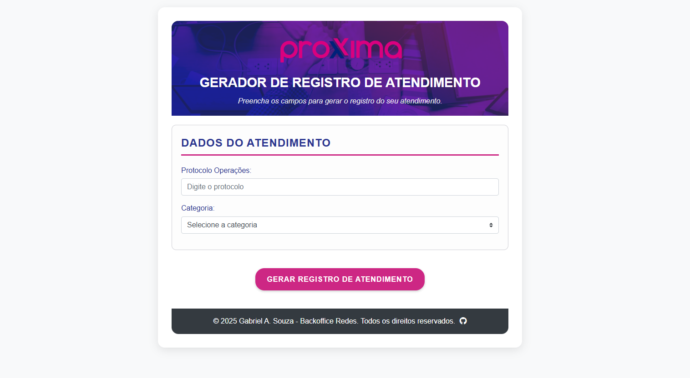

  <a href="#projeto">Projeto</a>   |   
  <a href="#funcionalidades">Funcionalidades</a>   |   
  <a href="#layout">Layout</a>   |   
  <a href="#elementosprincipais">Elementos Principais</a>   |   
  <a href="#tecnologias-ferramentas">Tecnologias & Ferramentas</a>   |   
  <a href="#autor">Autor</a>

## Sobre o projeto:

Uma aplicação web para registro de atendimentos técnicos da Proxxima Telecom, projetada para facilitar a comunicação entre os técnicos de campo e a equipe de backoffice (N2). Permite o registro rápido e eficiente de informações cruciais sobre o atendimento, como dados do cliente, informações do equipamento, tipo de serviço e descrição detalhada da ação realizada.

<h2 id="projeto">Apresentação do projeto:</h2> 

[Adicione aqui um GIF ou screenshot da aplicação em funcionamento]

**Responsivo:** A aplicação é totalmente responsiva e se adapta a diferentes tamanhos de tela, desde desktops até dispositivos móveis.

<h2 id="funcionalidades">Funcionalidades:</h2>

*   **Registro de Dados do Cliente:** Permite o registro de informações básicas do cliente, como protocolo e PPPoE.
*   **Registro de Informações do Equipamento:** Permite o registro de informações detalhadas sobre o equipamento utilizado, como Serial ONU (novo e antigo), Modo de Operação, Marca da ONU, VLAN e OLT.
*   **Seleção do Tipo de Atendimento:** Permite a seleção do tipo de atendimento realizado (Instalação/Ativação, Manutenção, Reparo, etc.).
*   **Descrição Detalhada da Ação:** Permite a descrição detalhada da ação realizada pelo técnico.
*   **Registro de Informações Adicionais:** Permite o registro de informações extras, como se a tentativa de solução foi realizada através do ANIEL.
*   **Geração e Cópia do Resumo:** Gera um resumo formatado do atendimento e permite que o técnico copie o texto para a área de transferência com um único clique.
*   **Integração com Zoho Cliq:** Inclui um link direto para o chat do Zoho Cliq, facilitando o compartilhamento do resumo do atendimento com a equipe de backoffice.

## 💻 Deploy:

- 

<h2 id="layout">🔖 Layout:</h2> 

O layout do projeto foi criado com foco na usabilidade e na responsividade, utilizando uma paleta de cores moderna e agradável. As seções do formulário são organizadas de forma clara e intuitiva, facilitando o preenchimento dos dados.

Você pode visualizar a paleta de cores do projeto através [DESSE LINK](https://uicolors.app/create). A cor que deu origem a paletra de cores é #2B3591.

<h2 id="elementosprincipais">Elementos principais da página:</h2>

*   Um cabeçalho com o título do projeto, a logo da Proxxima Telecom e uma breve descrição.
*   Um formulário para registro das informações do atendimento, dividido em seções lógicas.
*   Um botão para gerar e copiar o resumo do atendimento para a área de transferência.
*   Um botão (link) para abrir o chat do Zoho Cliq.
*   Uma área para exibir o resumo do atendimento (oculta até que o formulário seja submetido).
*   Um rodapé com informações sobre o autor e os direitos reservados, além de um link para o repositório no GitHub.

<h2 id="tecnologias-ferramentas">Tecnologias & Ferramentas:</h2>

### Tópicos abordados durante o projeto:

*   **JavaScript:**

    *   Manipulação do DOM para obter e definir valores de elementos HTML.
    *   Criação de funções para modularizar o código e facilitar a manutenção.
    *   Utilização de condicionais para controlar o fluxo da aplicação.
    *   Formatação de strings para criar o resumo do atendimento.
    *   Utilização da API Clipboard para copiar o texto para a área de transferência.
    *   Tratamento de eventos para responder às ações do usuário (cliques, mudanças, etc.).
    *   Responsividade da página.
*   **HTML5:**

    *   Criação de um formulário com diferentes tipos de campos (text, select, textarea, radio).
    *   Utilização de atributos para melhorar a acessibilidade (aria-label, aria-describedby).
    *   Estruturação do código HTML com elementos semânticos (<header>, <main>, <aside>, <footer>, <section>, etc.).
*   **CSS3:**

    *   Utilização de variáveis CSS para personalizar as cores e outros estilos.
    *   Criação de um layout responsivo com Flexbox e Grid Layout.
    *   Utilização de media queries para adaptar o layout a diferentes tamanhos de tela.
    *   Estilização de formulários com foco na usabilidade e na acessibilidade.

<h3 id="autor">Autor</h3>

*   Gabriel A. Souza - Backoffice Redes
    *   
    *   
    *   
    *   